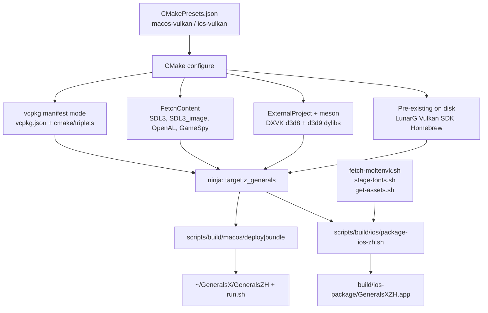

# Build and Packaging

How `GeneralsX-src` turns into a running game on macOS and on an iPhone/iPad.

Scope: `CMakePresets.json`, the vcpkg manifest and overlay triplets, the DXVK
meson `ExternalProject`, MoltenVK acquisition, `scripts/build/ios/`,
`scripts/build/macos/`, and asset acquisition. Windows/Linux/Flatpak paths are
mentioned only where they explain a shared code path.

Everything below was read out of the tree; non-obvious claims cite `file:line`.
Where the code and its own comments disagree, that is called out rather than
smoothed over.

---

## 1. How it fits together (read this first)

One CMake project, one build target that matters (`z_generals`), and **four
different dependency-acquisition mechanisms running side by side**. That last
point is the thing that confuses newcomers: there is no single "package
manager" here.



**Which mechanism owns which dependency** (this table is the fastest way to
orient):

| Dependency | Acquired by | Where declared |
|---|---|---|
| zlib, glm, gli, freetype, fontconfig, curl | vcpkg manifest | `vcpkg.json:4-25` |
| FFmpeg | vcpkg **on iOS only**; Homebrew via pkg-config on macOS | `vcpkg.json:26-30`, `CMakePresets.json:238-240` |
| SDL3 + SDL3_image | `FetchContent` from GitHub release tarballs | `cmake/sdl3.cmake:26-30`, `:107-111` |
| OpenAL Soft | `FetchContent` (**all** platforms) | `cmake/openal.cmake:32-36` |
| GameSpy SDK | `FetchContent` from a pinned git commit | `cmake/gamespy.cmake:4-10` |
| DXVK (d3d8 + d3d9) | `ExternalProject_Add` driving **meson + ninja** | `cmake/dx8.cmake:188-217` |
| MoltenVK (link time, iOS) | Static `.a` from the installed LunarG Vulkan SDK | `CMakePresets.json:274-275` |
| MoltenVK (runtime, iOS) | Dynamic `.framework` downloaded by a script | `scripts/build/ios/fetch-moltenvk.sh:18-21` |
| Vulkan loader + MoltenVK dylib (macOS) | Copied out of the LunarG SDK at deploy/bundle time | `scripts/build/macos/deploy-macos-zh.sh:108-124` |
| Game assets | steamcmd, from the user's own Steam account | `scripts/get-assets.sh:19-24` |
| Fonts | Liberation fonts, downloaded and renamed | `scripts/build/ios/stage-fonts.sh:30-33` |

**The two shapes of output are genuinely different:**

* macOS: `cmake --build` produces a *bare* executable at
  `build/macos-vulkan/GeneralsMD/GeneralsXZH`. Packaging is a shell script that
  hand-assembles a `.app` whose `CFBundleExecutable` is a **bash script**
  (`scripts/build/macos/bundle-macos-zh.sh:234-235`). Nothing is code-signed.
* iOS: `cmake --build` produces `build/ios-vulkan/GeneralsMD/GeneralsXZH.app/`
  — CMake makes a bundle automatically on iOS, see §2.4 — but that bundle is
  thrown away except for the executable inside it. The real `.app` comes from
  an Xcode "shell app" built purely to obtain a provisioning profile, into
  which the engine binary is transplanted (`scripts/build/ios/package-ios-zh.sh:104-125`).

---

## 2. CMakePresets.json

### 2.1 Inheritance

```
default-vcpkg  (hidden)            CMakePresets.json:77-89
   ├── macos-vulkan                CMakePresets.json:216-242
   ├── ios-vulkan                  CMakePresets.json:244-281
   ├── linux64-deploy              CMakePresets.json:196-214
   ├── unix, win32-vcpkg, ...
```

`default-vcpkg` supplies two things that matter on Apple:

* `CMAKE_TOOLCHAIN_FILE = $env{VCPKG_ROOT}/scripts/buildsystems/vcpkg.cmake`
  (`CMakePresets.json:86`). If `VCPKG_ROOT` is unset this expands to
  `/scripts/buildsystems/vcpkg.cmake` and configure fails with a confusing
  "toolchain file not found". `scripts/build/macos/build-macos-zh.sh:51-91`
  auto-resolves it; a raw `cmake --preset ios-vulkan` does not.
* `VCPKG_OVERLAY_TRIPLETS = ${sourceDir}/triplets` (`CMakePresets.json:87`) —
  which contains only `triplets/x86-windows.cmake`. Both Apple presets
  **override** this to `${sourceDir}/cmake/triplets`
  (`CMakePresets.json:227`, `:258`). Two overlay directories exist; only
  `cmake/triplets/` is relevant to Apple work.

### 2.2 `macos-vulkan`

Notable cache entries (`CMakePresets.json:222-241`):

| Variable | Value | Why |
|---|---|---|
| `CMAKE_BUILD_TYPE` | `RelWithDebInfo` | generator is plain `Ninja`, not multi-config |
| `CMAKE_OSX_ARCHITECTURES` | `arm64` | Apple Silicon only; the preset description says universal is deferred until all dylib deps are fat |
| `CMAKE_OSX_DEPLOYMENT_TARGET` | `15.0` | must match `cmake/triplets/arm64-osx.cmake:18` |
| `SAGE_USE_DX8` | `OFF` | selects the DXVK branch of `cmake/dx8.cmake:21` |
| `SAGE_USE_MOLTENVK` | `ON` | triggers `find_package(Vulkan REQUIRED COMPONENTS MoltenVK)` at `cmake/config-build.cmake:138` |
| `RTS_BUILD_OPTION_SAGE_PATCH` | `ON` | builds the optional `libsage_patch.dylib` interposer |
| env `PKG_CONFIG_PATH` | `/opt/homebrew/lib/pkgconfig` | how FFmpeg is found on macOS |

`VCPKG_TARGET_TRIPLET` is **not** set — vcpkg auto-detects `arm64-osx`, which
then picks up `cmake/triplets/arm64-osx.cmake`. Verified in the existing build
tree (`build/macos-vulkan/CMakeCache.txt:1395`).

`RTS_BUILD_GENERALS` is left at its default `ON` (`cmake/config-build.cmake:5`),
so a macOS configure also configures the base-game target `g_generals`.

### 2.3 `ios-vulkan`

Same skeleton, plus (`CMakePresets.json:250-280`):

* `CMAKE_SYSTEM_NAME=iOS`, `CMAKE_OSX_SYSROOT=iphoneos`, deployment target `16.0`.
* `VCPKG_TARGET_TRIPLET=arm64-ios` — set explicitly here, unlike macOS.
* `SAGE_DXVK_USE_LOCAL_FORK=ON` — iOS *must* build DXVK from the in-tree
  submodule, see §4.2.
* Everything optional switched off: `RTS_BUILD_GENERALS`,
  `RTS_BUILD_CORE_TOOLS`, `RTS_BUILD_ZEROHOUR_TOOLS`,
  `RTS_BUILD_ZEROHOUR_EXTRAS`, `SAGE_UPDATE_CHECK`,
  `RTS_BUILD_OPTION_SAGE_PATCH` (`:265-272`).
* Four `Vulkan_*` cache variables pointing at
  `$env{VULKAN_SDK}/lib/MoltenVK.xcframework/ios-arm64/libMoltenVK.a`
  (`:273-276`). With `VULKAN_SDK` unset these become `/lib/MoltenVK...` and
  `find_package(Vulkan)` fails. The env var is a hard prerequisite, not a
  convenience.
* env `PKG_CONFIG_PATH` is deliberately set to the **empty string** (`:278-280`)
  so a host Homebrew `.pc` cannot leak into a device build. FFmpeg still
  resolves, because vcpkg's toolchain puts `vcpkg_installed/arm64-ios` on
  `CMAKE_PREFIX_PATH` and CMake's `FindPkgConfig` folds `CMAKE_PREFIX_PATH`
  into the pkg-config search path. Confirmed in the existing cache:
  `FFMPEG_INCLUDE_DIRS` resolves under
  `build/ios-vulkan/vcpkg_installed/arm64-ios/`.

### 2.4 Why iOS emits a `.app` and macOS does not

Nothing in this repo asks for a bundle — `GeneralsMD/Code/Main/CMakeLists.txt:1`
is a plain `add_executable(z_generals WIN32)` and the `WIN32` keyword is inert
off Windows. CMake's own `Platform/Darwin.cmake:1-4` sets `CMAKE_MACOSX_BUNDLE ON`
when `CMAKE_SYSTEM_NAME` is `iOS`/`tvOS`/`visionOS`/`watchOS`. That is the whole
reason the iOS build tree has `GeneralsMD/GeneralsXZH.app/` and the macOS build
tree has a bare `GeneralsMD/GeneralsXZH`.

The CMake-generated iOS bundle is **not** what ships. `package-ios-zh.sh` reads
only the executable out of it (`scripts/build/ios/package-ios-zh.sh:43`).

### 2.5 There are no build presets for the Apple configurations

`buildPresets` (`CMakePresets.json:283-387`) covers vc6, win32, unix, mingw and
`linux64-deploy`. It does **not** include `macos-vulkan` or `ios-vulkan`. So:

```sh
cmake --build --preset macos-vulkan   # fails: no such build preset
cmake --build build/macos-vulkan --target z_generals   # correct
```

Every script and every doc uses the second form.

---

## 3. vcpkg

### 3.1 Manifest

`vcpkg.json` — manifest mode, baseline `533a5fda...` (`vcpkg.json:3`).
Dependencies are platform-gated:

* `zlib`, `glm`, `gli` — all platforms.
* `freetype` — `!windows`. Consumed at
  `Core/Libraries/Source/WWVegas/WW3D2/CMakeLists.txt:254`.
* `fontconfig` — `!windows & !ios`. iOS deliberately skips fontconfig and
  resolves fonts from a bundled `fonts/` directory instead
  (`Core/Libraries/Source/WWVegas/WW3D2/CMakeLists.txt:255-260`). On macOS the
  static fontconfig from vcpkg drags in iconv, which is why `find_package(Iconv)`
  is forced there too (`:259`).
* `openal-soft` — `!windows`. **Installed but never linked.** See §3.4.
* `curl` with the `ssl` feature — `!windows`. Only consumed when
  `SAGE_UPDATE_CHECK` is on (`cmake/curl.cmake:4-5`), which the iOS preset turns
  off (`CMakePresets.json:265`). Also built-but-unused on iOS.
* `ffmpeg` with avcodec/avformat/swscale/swresample — **iOS only**
  (`vcpkg.json:26-30`), pinned by `overrides` to 8.1.1 port-version 2
  (`vcpkg.json:32-42`).

`glm` and `gli` are consumed by the D3DX8 compatibility shim
(`GeneralsMD/Code/CompatLib/CMakeLists.txt:26-27`, `:31`).

### 3.2 Overlay triplets

`cmake/triplets/arm64-osx.cmake` and `cmake/triplets/arm64-ios.cmake` exist for
exactly one reason: pinning `VCPKG_OSX_DEPLOYMENT_TARGET` so vcpkg's static libs
match the engine's minimum OS version. Without them vcpkg builds against the
host SDK default (iOS 26.x on a current Xcode) and the final link emits hundreds
of `built for newer ... than being linked` warnings — and, worse, unguarded
newer-API use inside those libs can fault on an older device
(`cmake/triplets/arm64-ios.cmake:1-5`, `cmake/triplets/arm64-osx.cmake:1-11`).

Both set `VCPKG_LIBRARY_LINKAGE static`.

`cmake/triplets/arm64-osx.cmake:9-11` carries an instruction that is easy to
miss: **after editing a triplet you must delete `build/<preset>/vcpkg_installed`
and reconfigure.** vcpkg will not rebuild packages just because the triplet file
changed.

### 3.3 Verifying the cross-build actually cross-built

An iOS configure that silently falls back to host tooling produces macOS `.a`
files that link fine and then behave oddly. The check from
`docs/port/IPAD_BUILD_JOURNAL.md:78-85`:

```sh
ar x build/ios-vulkan/vcpkg_installed/arm64-ios/lib/libz.a adler32.c.o
otool -l adler32.c.o | grep -A3 LC_BUILD_VERSION
#  platform 2   <- 2 = iOS. 1 = macOS means the cross-build silently went host.
#  minos 16.0
```

### 3.4 Packages that are built and then ignored

Worth knowing before you spend time optimising vcpkg times:

* **openal-soft.** `cmake/openal.cmake:27-65` unconditionally `FetchContent`s
  openal-soft 1.24.2 for *all* platforms, and the root `CMakeLists.txt:93`
  includes it before any subdirectory. Every consumer is guarded with
  `if(NOT TARGET OpenAL::OpenAL)` (e.g.
  `GeneralsMD/Code/GameEngineDevice/CMakeLists.txt:259-262`), so the FetchContent
  target always wins. vcpkg's `libopenal.a` is present in
  `vcpkg_installed/arm64-ios/lib/` and links into nothing. The file even
  contradicts itself: `cmake/openal.cmake:5-8` says Linux uses the vcpkg copy,
  while `:2` and `:13` say FetchContent on all platforms. The code does the
  latter.
* **curl on iOS** — built because the manifest gate is `!windows`, unused
  because `SAGE_UPDATE_CHECK=OFF`.

### 3.5 `vcpkg-lock.json` — unclear, probably stale

`vcpkg-lock.json` lists `ffmpeg 7.1.1`, while `vcpkg.json:32-42` overrides
ffmpeg to `8.1.1#2`. The only reference to the file anywhere in the tree is as
a **GitHub Actions cache key** (`.github/workflows/build-linux.yml:71`). Nothing
consumes it as a lock file. Treat it as informational until proven otherwise;
if you change dependency versions, do it in `vcpkg.json`.

---

## 4. DXVK: built from source by meson, wrapped in `ExternalProject`

All of this lives in `cmake/dx8.cmake`, which is a three-way switch
(`:21`, `:31`, `:248`):

* `SAGE_USE_DX8=ON` → Windows, fetch `min-dx8-sdk` headers.
* `APPLE AND SAGE_USE_MOLTENVK` → build DXVK from source with meson. **This is
  the macOS and iOS path.**
* otherwise → Linux, download a pre-built `dxvk-native` tarball (`:251-255`).

The file's own header (`:8-10`) explains why the branches are exclusive: mixing
min-dx8-sdk headers with DXVK's full DirectX8+Wine headers makes the compiler
pick whichever include path comes first, which is usually the wrong one.

### 4.1 Host tooling

`meson` and `ninja` are located with `find_program` and hinted at
`/usr/local/bin` and `/opt/homebrew/bin`; both are `FATAL_ERROR` if missing
(`cmake/dx8.cmake:34-42`). DXVK's meson configure also needs `glslangValidator`,
which ships in the Vulkan SDK's `bin/` — `scripts/build/macos/build-macos-zh.sh:118`
prepends that directory to `PATH` for exactly this reason.

### 4.2 Two source modes

```
SAGE_DXVK_USE_LOCAL_FORK=ON  and references/fbraz3-dxvk/.git exists
    -> build from the submodule working tree            dx8.cmake:67-90, 188-199
CMAKE_SYSTEM_NAME == iOS and the above is false
    -> FATAL_ERROR                                      dx8.cmake:91-94
otherwise
    -> git clone fbraz3/dxvk at pinned commit 46a3bc01  dx8.cmake:200-217
```

`references/fbraz3-dxvk` is a git submodule (`.gitmodules`, branch
`generalsx-macos-v2.6`), currently checked out at `46a3bc018bcae4...` — the same
commit as `DXVK_REMOTE_REF` at `cmake/dx8.cmake:202`. So local-fork and remote
modes build the same source; the difference is that only the local mode can
receive the iOS patch.

The hard error for iOS without the submodule (`:91-94`) is deliberate: the
comment records that a silent fallback used to produce dylibs that die at
Vulkan init on device.

### 4.3 The iOS patch is applied to your working tree at configure time

`cmake/dx8.cmake:74-90`, when `CMAKE_SYSTEM_NAME` is iOS:

1. `git -C references/fbraz3-dxvk apply --reverse --check Patches/dxvk-ios.patch`
2. if that check fails (patch not yet applied), apply it for real
3. if applying fails → `FATAL_ERROR`

This is idempotent, but it **mutates a git submodule's working tree as a side
effect of running `cmake --preset ios-vulkan`.** After an iOS configure,
`git -C references/fbraz3-dxvk status` is dirty. See Gotchas.

`Patches/dxvk-ios.patch` is small and worth reading in full (56 lines). It does
two things:

* Adds `@executable_path/Frameworks/MoltenVK.framework/MoltenVK` and
  `@executable_path/Frameworks/libMoltenVK.dylib` to the front of DXVK's Vulkan
  loader `dlopen` list (`Patches/dxvk-ios.patch:20-25`). iOS confines `dlopen`
  to the app bundle, so bare library names never resolve.
* Switches the SDL3 WSI from `SDL_GetWindowSize` to `SDL_GetWindowSizeInPixels`
  (`:34`, `:46-53`) so the swapchain is sized in pixels, not points — otherwise
  on a high-DPI iOS drawable the game renders into a corner of the surface.

### 4.4 Machine files (native vs cross)

* macOS: `--native-file cmake/meson-arm64-native.ini` (`dx8.cmake:161`).
* iOS: a cross file generated from
  `cmake/meson-arm64-ios-cross.ini.in` by `configure_file`, with `@IOS_SDK@`
  filled from `xcrun --sdk iphoneos --show-sdk-path` (`dx8.cmake:151-159`). The
  template is used precisely so the SDK path is not hardcoded to `Xcode.app`
  (works with Xcode-beta / renamed installs).

Target arch is taken from `CMAKE_OSX_ARCHITECTURES`, *not* `uname -m`
(`dx8.cmake:50-59`) — on an Apple Silicon Mac where CMake or meson happens to be
running under Rosetta, `uname -m` says `x86_64` and you would silently get an
x86_64 dylib the arm64 game cannot `dlopen`.

### 4.5 The generated `sdl3.pc`

`cmake/dx8.cmake:168-185` writes a pkg-config file into
`${CMAKE_BINARY_DIR}/sdl3-pkgconfig/sdl3.pc` pointing at the in-tree
FetchContent SDL3, and prepends that directory to `PKG_CONFIG_PATH` for the
meson invocation. The comment (`:166-167`) explains the failure it prevents:
without it meson silently resolves a system SDL2 and compiles the WSI as
`Sdl2WsiDriver`, which cannot drive the SDL3 window the game creates, and D3D
device creation fails at runtime.

Two frictions here:

* The `.pc` hardcodes `Version: 3.4.2` (`dx8.cmake:176`). Bumping `SDL3_VERSION`
  in `cmake/sdl3.cmake:22` without bumping this string leaves a lying `.pc`.
* The header comment in `cmake/meson-arm64-ios-cross.ini.in:3` still says SDL3
  "must be discoverable via `PKG_CONFIG_PATH (build/ios/sdl3-install/lib/pkgconfig)`",
  a path that no longer exists. Stale; the generated `.pc` is the live
  mechanism.
* CI still does `brew install sdl3` "so DXVK's Meson build discovers it via
  pkg-config" (`.github/workflows/build-macos.yml:101-105`). The generated
  directory is prepended, so it wins — the Homebrew install is now redundant,
  but harmless.

### 4.6 Build and install steps

```
CONFIGURE: env CC/CXX=clang, CFLAGS/CXXFLAGS="-arch <arch> -mcpu=apple-m1",
           PKG_CONFIG_PATH=<generated>:..., VULKAN_SDK=...,
           meson setup <build> <src> <machine-file>
           -Ddxvk_native_wsi=sdl3 --buildtype=release --reconfigure
BUILD:     ninja -C <build> src/d3d9/libdxvk_d3d9.0.dylib
                            src/d3d8/libdxvk_d3d8.0.dylib
INSTALL:   "" (none)
```
(`cmake/dx8.cmake:195-196` local mode, `:212-213` remote mode.)

A separate `add_custom_command` + `add_custom_target(dxvk_d3d8_install ALL)`
copies both dylibs to the build root and creates unversioned symlinks
(`dx8.cmake:221-238`). Note the comment at `:220`: **d3d8 links against d3d9,
so both must be present at runtime** — never ship one without the other.

The Vulkan SDK is located by a three-stage search: `$VULKAN_SDK` (normalised if
it points at the version root rather than the `macOS/` subdir), then
`~/VulkanSDK/*/macOS` sorted newest-first, then two Homebrew Caskroom paths
(`dx8.cmake:107-136`). If none is found it only *warns* and lets meson search
system paths (`:142`).

### 4.7 How the engine loads DXVK at runtime

Not linked — `dlopen`ed, in `Core/Libraries/Source/WWVegas/WW3D2/dx8wrapper.cpp:577-588`:

```c
#elif defined(__APPLE__)
  #if defined(TARGET_OS_IPHONE) && TARGET_OS_IPHONE
  D3D8Lib = LoadLibrary("@executable_path/Frameworks/libdxvk_d3d8.0.dylib");
  #else
  D3D8Lib = LoadLibrary("libdxvk_d3d8.dylib");   // via DYLD_LIBRARY_PATH from run.sh
  #endif
```

`cmake/dxvk-macos-patches.py` is a **deprecated no-op** (`:19`) left behind from
the era when macOS DXVK fixes were applied as local patch scripts. Ignore it;
the DEV_BLOG references to its "Patch 11/12/13" are history, not current
behaviour.

---

## 5. MoltenVK: two separate copies, two separate purposes

This trips people up. On iOS there are **two** MoltenVKs in play:

| | Static, link time | Dynamic, run time |
|---|---|---|
| Artifact | `libMoltenVK.a` from `MoltenVK.xcframework/ios-arm64` | `MoltenVK.framework` |
| Source | The LunarG Vulkan SDK you installed | Khronos GitHub release, `MoltenVK-ios.tar` |
| Wired up by | `CMakePresets.json:274-275` → `find_package(Vulkan)` at `cmake/config-build.cmake:138` | `scripts/build/ios/fetch-moltenvk.sh`, embedded at `package-ios-zh.sh:159-168` |
| Consumed by | the engine binary | DXVK, via the patched `dlopen` list |

`fetch-moltenvk.sh` pins `v1.4.1` with a SHA-256 that is verified after download
(`scripts/build/ios/fetch-moltenvk.sh:7-8`, `:20`); bump both together. It
stages to `${GX_MOLTENVK_ROOT:-$HOME/GeneralsX/MoltenVK}` and is a no-op if
already present (`:13-16`).

Because MoltenVK links **statically** on iOS, its framework dependencies must be
supplied by the consumer — hence the explicit `-framework Metal / IOSurface /
CoreGraphics / QuartzCore / Foundation / UIKit` block at
`cmake/config-build.cmake:145-156`, which is iOS-only (the macOS dylib resolves
these itself).

On macOS there is no static copy: `deploy-macos-zh.sh:108-124` copies
`libvulkan.dylib`, `libvulkan.1.dylib` and `libMoltenVK.dylib` out of the SDK
into the runtime directory and writes a `MoltenVK_icd.json` manifest next to
them.

---

## 6. `scripts/build/ios/package-ios-zh.sh`, step by step

252 lines. Usage: `[--dev] [--install]` (`:14-16`). `--dev` skips the ~2.7 GB
asset copy; `--install` pushes to a connected device.

**0. Preconditions.** `GAME_BIN` must exist at
`build/ios-vulkan/GeneralsMD/GeneralsXZH.app/GeneralsXZH` (`:43`, `:46-49`) —
i.e. the CMake build must already have run.

**1. Find the device — and note there are two different identifiers.** `:51-78`
documents the distinction carefully:

* **CoreDevice UUID** (8-4-4-4-12) — what `devicectl list devices` prints and
  what `devicectl device install` expects.
* **Hardware UDID** (8-16) — what `xcodebuild -destination id=` expects and what
  appears in a profile's `ProvisionedDevices`.

The script resolves the UUID from the listing (`find_device_uuid`, `:64-70`),
then asks `devicectl device info details` for the hardware UDID
(`find_device_udid`, `:72-78`). The state filter excludes `unavailable` *before*
matching `available|connected`, because a naive match on "available" also
matches "unavailable" (`:58-60`). Both functions end in `|| true` so a missing
device cannot kill the script under `set -euo pipefail` (`:62-63`) — this is a
direct fix for Defect 3 in the build journal
(`docs/port/IPAD_BUILD_JOURNAL.md:172-189`).

**2. Generate and build the provisioning shell app.** `xcodegen generate` from
`ios/project.yml` (`:100-101`), then `xcodebuild ... -allowProvisioningUpdates`
against `platform=iOS,id=<UDID>` when a device is present, `generic/platform=iOS`
otherwise (`:84-98`, `:104-110`). Targeting the specific device is essential:
with a generic destination Xcode has no device to register, reuses a cached
profile, and the install is then refused
(`:79-83`; journal Defect 2, `IPAD_BUILD_JOURNAL.md:142-170`).

The shell app is a real Xcode target whose only purpose is (a) a provisioning
profile and (b) the `Info.plist` (`ios/project.yml:3-7`). The plist declares
landscape-only, fullscreen, hidden status bar, `UIFileSharingEnabled`, and
`CADisableMinimumFrameDurationOnPhone` (`ios/project.yml:31-48`).

**3. Executable swap.** The shell app is copied to `build/ios-package/`, and the
stub executable is overwritten with the engine binary (`:118-125`).

**4. Embed dylibs.** Six libraries are copied into `Frameworks/` (`:127-149`):
`libdxvk_d3d8.0.dylib`, `libdxvk_d3d9.0.dylib`, `libSDL3.0.dylib`,
`libSDL3_image.0.dylib`, `libopenal.1.24.2.dylib`, and `libgamespy.dylib`.
`libgamespy.dylib` is the only optional one; the rest are fatal if missing.
openal is then **renamed** to `libopenal.1.dylib` to match its install name
(`:151-154`).

**5. Embed MoltenVK.framework** from `${GX_MOLTENVK:-...}` — fatal if absent,
because an app without it launches and dies at Vulkan init (`:156-168`). The
comment records that this used to live in `/tmp`, which the OS periodically
cleans.

**6. rpath.** A single `install_name_tool -add_rpath "@executable_path/Frameworks"`
on the executable (`:221`). No install-name rewriting happens, despite the file
header claiming "their install names rewritten to `@rpath`" (`:9`). It is not
needed: SDL3, SDL3_image, OpenAL, GameSpy and both DXVK dylibs already ship with
`@rpath/...` install names — verified with `otool -D` on the packaged app. The
header comment overstates what the script does.

Subtlety worth internalising: `libdxvk_d3d8.0.dylib`'s only `LC_RPATH` is
`@loader_path/../d3d9` (a meson build-tree layout that does not exist in the
bundle). Its `@rpath/libdxvk_d3d9.0.dylib` dependency resolves only because dyld
also searches the **main executable's** rpaths for `dlopen`ed images — i.e. the
`@executable_path/Frameworks` added at line 221 is what makes d3d8 → d3d9 work.
Remove that line and DXVK fails to load with a confusing "image not found" for
d3d9.

**7. Asset bundling** (skipped under `--dev`), `:170-207`:

* `rsync -a` from `${GX_GAME_DATA:-$HOME/GeneralsX/GeneralsZH}` into
  `<app>/GameData/` with a long exclude list (`:179-188`).
* Fonts from `${GX_FONTS:-$HOME/GeneralsX/ios-staging/fonts}` into
  `GameData/fonts/`; **fatal if missing**, because the game renders no text at
  all without them (`:189-197`).
* `ios/config/dxvk.conf` → `GameData/dxvk.conf` and `ios/config/Options.ini` →
  `GameData/DefaultOptions.ini`; both fatal if missing (`:198-205`).

The exclude list looks arbitrary until you realise the default source directory
is *the same directory* `scripts/build/macos/deploy-macos-zh.sh` writes the
macOS runtime into. That is why it excludes `*.dylib`, `run.sh`, `GeneralsXZH`,
`MoltenVK_icd.json`, `dxvk.conf`, `fontconfig`, and `*.dxvk-cache` — those are
macOS deploy artifacts, not game data. The remaining excludes
(`RedistInstallers`, `_CommonRedist`, `steamapps`, `00000000.*`, `*.exe`-adjacent
junk) are Steam depot leftovers.

**8. Icons.** Three PNGs are generated with `sips` into the bundle root
(`:210-218`). This is not redundant with the asset catalog: `actool` emits
`CFBundleIcons.CFBundlePrimaryIcon.CFBundleIconFiles = ["AppIcon60x60", ...]`
into the Info.plist, and SpringBoard will read the loose `AppIcon60x60@2x.png`
even when it refuses to read `Assets.car` icons from a developer-signed sideload
before a reboot. (`AppIcon83.5x83.5@2x.png` is not referenced by the generated
plist and appears to be dead weight.)

**9. Inside-out signing.** `:223-236`:

```sh
codesign -d --entitlements - --xml "${SHELL_APP}" > entitlements.plist
for f in Frameworks/*.dylib; do codesign --force --sign "$IDENTITY" --timestamp=none "$f"; done
codesign --force --sign "$IDENTITY" --timestamp=none Frameworks/MoltenVK.framework
codesign --force --sign "$IDENTITY" --timestamp=none --entitlements entitlements.plist "$APP"
codesign --verify --deep "$APP"
```

Entitlements are *extracted from the Xcode-built shell app* rather than written
by hand — that is how `get-task-allow` and the team identifier survive the
transplant. Signing order matters: nested code first, outer bundle last.

**10. Install.** `xcrun devicectl device install app --device "${DEVICE_UUID}" "${APP}"`
(`:244`) — by **CoreDevice UUID**, whereas step 2 provisioned against the
**hardware UDID**. Both refer to the same physical device; using the wrong one
in either place fails.

Signing identity/team/bundle-id are all env-overridable:
`GX_SIGN_IDENTITY`, `GX_TEAM_ID`, `GX_BUNDLE_ID` (`:36-41`).

### Shipped bundle layout

From `docs/port/IPAD_BUILD_JOURNAL.md:306-325`, and matching the tree on disk:

```
GeneralsXZH.app                     ~2.8 GB
├── GeneralsXZH                     37 MB, arm64, platform 2, minos 16.0
├── Frameworks/
│   ├── MoltenVK.framework          dlopen target for DXVK
│   ├── libdxvk_d3d8.0.dylib
│   ├── libdxvk_d3d9.0.dylib
│   ├── libSDL3.0.dylib
│   ├── libSDL3_image.0.dylib
│   ├── libopenal.1.dylib
│   └── libgamespy.dylib
├── GameData/                       .big archives, ZH_Generals/, fonts/,
│                                   dxvk.conf, DefaultOptions.ini
├── Assets.car, AppIcon*.png, Info.plist, PkgInfo
├── embedded.mobileprovision
└── _CodeSignature/
```

### `--dev` is an iteration mode, not a shipping mode

`--dev` skips fonts and config too, because they live inside the same
`if [[ "${DEV_MODE}" != "1" ]]` block (`:176-207`). The engine then falls back
to `~/Documents` (`GeneralsMD/Code/Main/SDL3Main.cpp:439-452`). Two consequences,
documented at `IPAD_BUILD_JOURNAL.md:327-348`:

1. no fonts → no text at all;
2. `DefaultOptions.ini` seeding is gated on `usingBundleData`, so a Documents-mode
   launch keeps the 2003-era GPU autodetect and drops to Low LOD.

And a destructive one: a **bundle-mode** launch performs a one-time tidy-up that
*deletes* `.big` files, `Data`, `ZH_Generals`, `fonts` and `dxvk.conf` from
`Documents` (`SDL3Main.cpp:481-487`). Installing a bundled build over a
`--dev` install destroys the externally staged assets. The two layouts cannot be
mixed.

---

## 7. `scripts/build/macos/`

Seven scripts, in two families (`-zh` for Zero Hour, `-generals` for the base
game). The ZH ones are the maintained pair; see Gotchas for the drift.

### `build-macos-zh.sh` — configure + build

* Checks `cmake`, `ninja`, `meson`, `python3` (`:45-48`).
* Resolves `VCPKG_ROOT` from the environment, then `./vcpkg`, `~/vcpkg`,
  `/opt/vcpkg`, `/opt/homebrew/opt/vcpkg`, `/usr/local/opt/vcpkg`,
  `brew --prefix vcpkg` (`:51-91`).
* Resolves the Vulkan SDK from `$VULKAN_SDK`, `$VULKAN_SDK_ROOT`, then
  `~/VulkanSDK/*/macOS`, accepting either the `macOS/` dir or its parent
  (`:96-113`), exports it, and prepends `$VULKAN_SDK/bin` to `PATH` for
  `glslangValidator` (`:118`).
* `cmake --preset macos-vulkan`, then
  `cmake --build build/macos-vulkan --target z_generals -j<N>` where
  **N is half the logical CPU count** (`:131`). No comment explains why; assume
  memory pressure during the heavy template-instantiating translation units.
* Everything is teed to `logs/build_zh_macos-vulkan.log`.

`--build-only` skips the configure step (`:26-29`).

### `deploy-macos-zh.sh` — the developer runtime layout

Assembles `~/GeneralsX/GeneralsZH/` (falling back to the legacy
`~/GeneralsX/GeneralsMD/`, chosen by which one actually contains `*.big`,
`:20-36`):

* the binary (`:78`), SDL3 + SDL3_image with unversioned symlinks (`:82-86`),
  `libgamespy.dylib` (`:89`), both DXVK dylibs with symlinks (`:102-105`);
* DXVK dylibs are looked up in the build root *and* the raw meson output dir, to
  avoid shipping a stale copy (`:16-19`, `:56-61`);
* `libvulkan*.dylib` + `libMoltenVK.dylib` from the SDK, plus a generated
  `MoltenVK_icd.json` (`:107-124`);
* `resources/dxvk/dxvk.conf`, **fatal if absent** (`:136-147`);
* optional `libsage_patch.dylib` (`:152-156`);
* fontconfig `fonts.conf` + `conf.d` copied out of
  `vcpkg_installed/arm64-osx/etc/fonts` (`:168-182`);
* a generated `run.sh` wrapper (`:185-238`).

The generated `run.sh` is where the macOS runtime environment actually lives:
`DYLD_LIBRARY_PATH`, optional `DYLD_INSERT_LIBRARIES` for SagePatch,
`DXVK_WSI_DRIVER=SDL3` (required by DXVK on non-Win32, and it must match the
game's windowing layer), `DXVK_HUD=0` by default (MoltenVK on macOS 26 cannot
compile DXVK's HUD shader — `gl_DrawID`/SPIR-V `DrawIndex` has no MSL
equivalent, and enabling it breaks the swapchain blit), `VK_ICD_FILENAMES` +
`VK_DRIVER_FILES`, `FONTCONFIG_FILE`/`FONTCONFIG_PATH`, and finally a `cd` to
the script directory before `exec ./GeneralsXZH` (`:231-237`) — without that
`cd`, anything launched by absolute path misses every loose INI and sees only
what is inside the `.big` archives.

### `bundle-macos-zh.sh` — the distributable `.app` + zip

Builds `GeneralsXZH.app` in a temp dir and zips it to
`GeneralsXZH-macos-arm64.zip` (`:22`, `:457-461`). Layout is unusual:
`Contents/MacOS/run.sh` is the `CFBundleExecutable` (`:234-235`), the real binary
lives at `Contents/Resources/bin/GeneralsXZH`, and dylibs at
`Contents/Resources/lib/`. A `Contents/MacOS/GeneralsXZH` symlink to `run.sh`
keeps name-based invocation working (`:445`).

The interesting part is `collect_external_dylibs` (`:104-170`): a breadth-first
`otool -L` walk from the binary and the known dylibs, resolving `@loader_path`,
`@executable_path` and `@rpath` references (`resolve_dep_path`, `:42-102`),
skipping `/System/Library` and `/usr/lib`, dereferencing symlinks with `cp -L`,
and warning rather than silently dropping anything it cannot resolve (`:148-151`).
`@rpath` resolution falls back to `/opt/homebrew/lib`, `/usr/local/lib`, then
`brew --prefix` paths (`:82-98`) — this is how Homebrew FFmpeg's transitive
codec dylibs end up in the bundle.

Missing Vulkan SDK is fatal unless `GX_ALLOW_MISSING_VULKAN_IN_BUNDLE=1`
(`:324-336`). The scan can be disabled with
`GX_BUNDLE_INCLUDE_EXTERNAL_DYLIBS=0` (`:192`, `:304-306`).

**The bundle is never code-signed or notarised.** There is no `codesign` call in
the file. A downloaded zip will be quarantined on another machine.

### `run-macos-zh.sh`

Launches from the deployed runtime dir (not the build dir), re-exports the same
env as the generated `run.sh`, falls back to the SDK's own `MoltenVK_icd.json`
if the deployed one is absent (`:46-55`), optionally clears the DXVK shader
cache under `GX_CLEAR_DXVK_SHADER_CACHE=1` (`:84-90`), and tees to
`logs/run_zh_macos.log`.

### The `-generals` variants

`build-macos-generals.sh`, `deploy-macos-generals.sh`, `bundle-macos-generals.sh`
target `g_generals` / `GeneralsX` / `~/GeneralsX/Generals`. They are older
copies: `build-macos-generals.sh` still only globs `~/VulkanSDK/*/macOS`
(`:83-93`), never exports `VULKAN_SDK`, and never adds the SDK's `bin/` to
`PATH` — so a fresh machine that keeps its SDK elsewhere, or that lacks
`glslangValidator` on `PATH`, fails in the DXVK meson step with no useful
message. Port fixes from the `-zh` scripts when you touch these.

---

## 8. Asset acquisition

`scripts/get-assets.sh <steam_username>` (33 lines):

```sh
steamcmd +@sSteamCmdForcePlatformType windows \
         +force_install_dir ~/GeneralsX/.steamcmd_zh \
         +login <user> +app_update 2732960 validate +quit
rsync -a --exclude="*.exe" --exclude="*.dll" ~/GeneralsX/.steamcmd_zh/ ~/GeneralsX/GeneralsZH/
```
(`:19-28`.) App `2732960` is C&C Generals Zero Hour; the Windows depot is forced
because the data files are platform-independent (`:18`). The rsync deliberately
preserves anything already in the destination — `run.sh`, dylibs, the deployed
binary (`:27`).

Nothing about assets is in git, and the release checklist explicitly gates on
that (`docs/port/RELEASE_CHECKLIST.md`, "Assets" item).

Fonts are separate: `scripts/build/ios/stage-fonts.sh` downloads Liberation
2.1.5 (checksummed, `:7-8`, `:26`) and renames the faces to the Windows names the
engine asks for (`:30-33`):

```
LiberationSans-Regular.ttf  -> arial.ttf
LiberationSans-Bold.ttf     -> arialbold.ttf
LiberationMono-Regular.ttf  -> couriernew.ttf
LiberationSerif-Regular.ttf -> timesnewroman.ttf
```

The renamed copies are intentionally never committed — renamed-to-arial files
invite confusion even though Liberation's licence permits redistribution
(`RELEASE_CHECKLIST.md`, "Fonts" item).

---

## 9. CI

`.github/workflows/ci.yml` fans out to `build-linux-flatpak.yml` and
`build-macos.yml`, then replay tests. **There is no iOS workflow** — the iOS
build and the whole packaging pipeline are verified by hand only. Anything you
change in `scripts/build/ios/` has no automated coverage.

`build-macos.yml` runs `macos-latest`, pins vcpkg to commit `ffc071e0...`
(`:63`), installs the toolchain plus Homebrew FFmpeg and its codec deps,
`glslang`, `freetype`, `fontconfig` and `sdl3`, and downloads a SHA-256-verified
LunarG SDK 1.4.341.1 zip. Two comments in it are stale:

* `:94` claims GLM comes from `cmake/glm.cmake` via FetchContent. That file does
  not exist; GLM comes from vcpkg (`vcpkg.json:6`,
  `GeneralsMD/Code/CompatLib/CMakeLists.txt:26`). The *conclusion* (don't
  `brew install glm`) is still right — a Homebrew GLM would collide with the
  vcpkg one.
* `:101-105` justifies `brew install sdl3` for DXVK's meson discovery; superseded
  by the generated `sdl3.pc` (§4.5).

---

## 10. Gotchas

Ordered roughly by how much time they cost.

**1. Paths containing spaces break the build.** FFmpeg's `configure` emits
`--extra-ldflags=-L<path>` unquoted, so a clone under
`/Users/x/Desktop/claude work/...` fails ~3 s into the vcpkg step with
`clang: error: no such file or directory: 'work/GeneralsX/...'`
(`IPAD_BUILD_JOURNAL.md:191-206`). This only bites the iOS preset, because that
is the only configuration where FFmpeg is a vcpkg dependency (`vcpkg.json:26-30`).
There is still **no configure-time guard**; adding one to the root
`CMakeLists.txt` next to the in-source-build check (`CMakeLists.txt:29-31`) is
listed as an open item at `IPAD_BUILD_JOURNAL.md:440`.

**2. `--recursive` on the DXVK submodule is mandatory.**
`git submodule update --init references/fbraz3-dxvk` is not enough: DXVK vendors
Vulkan-Headers, SPIRV-Headers, mingw-directx-headers and libdisplay-info as its
*own* submodules. Without them meson dies with
`Check usable header "vulkan/vulkan.h" : NO` /
`ERROR: Problem encountered: Missing Vulkan-Headers`, which does not hint at the
cause (`IPAD_BUILD_JOURNAL.md:110-140`). Use
`git submodule update --init --recursive references/fbraz3-dxvk`.

Do **not** run a bare `git submodule update --init --recursive` at the repo root
unless you want it: `.gitmodules` also lists four large reference checkouts
(`references/fighter19-dxvk-port`, `references/jmarshall-win64-modern`,
`references/thesuperhackers-main`, `references/generals-online-client`) and
`GeneralsReplays`. Only `references/fbraz3-dxvk` is needed to build.

**3. Configuring the iOS preset dirties a submodule.**
`cmake --preset ios-vulkan` applies `Patches/dxvk-ios.patch` into
`references/fbraz3-dxvk`'s working tree (`cmake/dx8.cmake:74-90`). Two
consequences: the submodule shows as modified afterwards, and if you then build
macOS with `SAGE_DXVK_USE_LOCAL_FORK=ON` you get iOS-patched DXVK on macOS.
(Both patch hunks are harmless on macOS by design, but it is not what the
preset says it is doing.) The reverse-check makes it idempotent, so re-running
is safe; `git submodule update --force` is what un-does it.

**4. No build presets for the Apple configurations.** Use
`cmake --build build/<preset> --target z_generals` (§2.5).

**5. `VCPKG_ROOT` and `VULKAN_SDK` are hard requirements of the iOS preset.**
Neither has a fallback inside `CMakePresets.json`; both produce misleading
errors when unset (§2.1, §2.3). The macOS *scripts* paper over this, the iOS
path does not.

**6. Changing a triplet does not rebuild vcpkg packages.** Delete
`build/<preset>/vcpkg_installed` and reconfigure
(`cmake/triplets/arm64-osx.cmake:9-11`).

**7. The packaged iOS binary carries absolute build-tree rpaths.** Because the
executable is copied straight out of the build tree (`package-ios-zh.sh:125`)
with no CMake install step, its `LC_RPATH` list is
`/Users/<you>/GeneralsX-src/build/ios-vulkan/_deps/sdl3_image-build`,
`.../sdl3-build`, `.../build/ios-vulkan`, `.../openal_soft-build`, and *then*
`@executable_path/Frameworks` — the added one is searched **last**. On a device
the absolute paths simply don't exist, so it works; it also leaks the builder's
home directory into the shipped binary and would prefer stale build-tree dylibs
in any host-side test.

**8. `libdxvk_d3d8` finds `libdxvk_d3d9` only via the executable's rpath.**
d3d8's own `LC_RPATH` is `@loader_path/../d3d9`, a meson build-tree path absent
from the bundle (§6 step 6). Anything that drops the
`@executable_path/Frameworks` rpath, or that ships d3d8 without d3d9, breaks
renderer init.

**9. `~/GeneralsX/GeneralsZH` is shared between the macOS deploy and the iOS
asset source.** `deploy-macos-zh.sh` writes runtime files into it;
`package-ios-zh.sh` rsyncs *out of* it. The long exclude list at
`package-ios-zh.sh:179-188` exists to filter the macOS artifacts back out. If
you add a new file to the macOS deploy, add a matching exclude — otherwise it
silently ships inside the iOS bundle.

**10. The rsync excludes are broad and match at any depth.** `--exclude="*.txt"`,
`--exclude="*.dat"`, `--exclude="*.bmp"` etc. apply to subdirectories too. If a
future asset needs one of those extensions inside `Data/`, it will vanish from
the bundle with no warning. Verify with `ls` inside the packaged app, not by
reading the script.

**11. Free-tier provisioning profiles expire in 7 days.** The app stops
launching until re-signed and reinstalled; a paid account gives a year
(`IPAD_BUILD_JOURNAL.md:287-299`). Also: `ProvisionedDevices` is authoritative —
a profile that does not list the target device is refused at install time.

**12. The macOS `.app` is unsigned.** `bundle-macos-zh.sh` never calls
`codesign`. Distributing the zip means the recipient fights Gatekeeper.

**13. Two dependencies are built and never used**: vcpkg's `openal-soft` (all
non-Windows), and vcpkg's `curl` on iOS (§3.4). Removing them from
`vcpkg.json` would cut cold-configure time, but check the Linux path first —
`cmake/openal.cmake`'s comments still assume vcpkg owns OpenAL there even though
the code does not.

**14. Beware shadowed shell tools.** `stage-fonts.sh:28` locates the extracted
fonts with a bare `find`; on the reference machine `~/.local/bin/find` was a
libc-database wrapper earlier on `PATH` and silently broke it
(`IPAD_BUILD_JOURNAL.md:264-276`). Homebrew's `steamcmd` cask also arrives
quarantined and needs
`xattr -dr com.apple.quarantine /opt/homebrew/Caskroom/steamcmd/<version>`
(`:278-283`).

**15. LunarG's `vulkan_sdk.dmg` is actually a zip.** `hdiutil attach` fails with
`image not recognized`; unzip it instead (`IPAD_BUILD_JOURNAL.md:43-46`). Use the
LunarG SDK, not the Homebrew cask.

---

## 11. Where to look next

| Question | File |
|---|---|
| Which preset sets what | `CMakePresets.json` |
| Where a dependency comes from | `cmake/dx8.cmake`, `cmake/sdl3.cmake`, `cmake/openal.cmake`, `cmake/gamespy.cmake`, `vcpkg.json` |
| Build feature flags (`RTS_*`, `SAGE_*`) | `cmake/config-build.cmake` |
| Why the iOS DXVK differs | `Patches/dxvk-ios.patch`, `cmake/dx8.cmake:67-94` |
| Runtime asset/CWD resolution on iOS | `GeneralsMD/Code/Main/SDL3Main.cpp:415-490` |
| A narrated clean-machine run with every failure | `docs/port/IPAD_BUILD_JOURNAL.md` |
| Cross-compile verification methodology | `docs/port/PORTING_PATTERNS.md` §5 |
| Pre-release gates | `docs/port/RELEASE_CHECKLIST.md` |

### Known-unclear, stated honestly

* **`vcpkg-lock.json`** — format does not match anything vcpkg consumes, contents
  contradict `vcpkg.json`'s overrides, and its only in-tree use is a CI cache
  key. Either it is vestigial or it is fed by tooling not present in this repo.
  Start at `.github/workflows/build-linux.yml:71`.
* **Half-CPU parallelism** in `build-macos-zh.sh:131` is unexplained. Likely peak
  RSS during heavy TUs, but nothing documents it; measure before "fixing" it.
* **`cmake/meson-arm64-native.ini`** puts arch flags under `[properties]`
  (`:7-11`) while the iOS cross template puts them under `[built-in options]`
  (`cmake/meson-arm64-ios-cross.ini.in:20-24`). Modern meson reads compiler args
  from `[built-in options]`; the native file's `[properties]` block may be inert,
  with the real arch coming from the `CFLAGS`/`CXXFLAGS` set on the
  `ExternalProject` configure command (`cmake/dx8.cmake:195`). Worth confirming
  before relying on the native file for anything.
