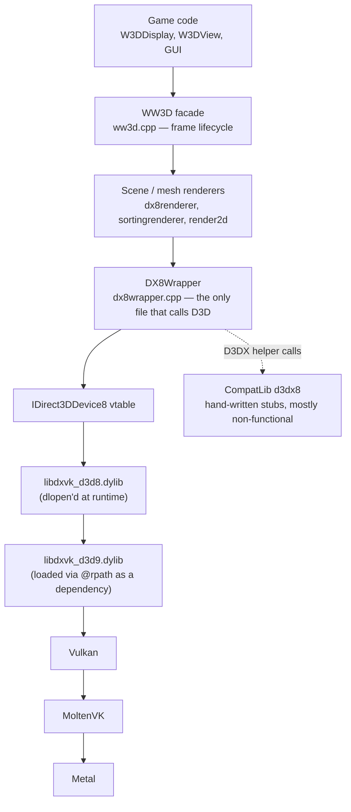

# Rendering Architecture

How the W3D renderer reaches the screen on macOS/iOS, and where the Apple port
diverges from the 2003 Windows original.

> Scope: `Core/Libraries/Source/WWVegas/WW3D2/`, `GeneralsMD/Code/Libraries/Source/WWVegas/WW3D2/`,
> the D3DX compatibility shims in `GeneralsMD/Code/CompatLib/`, and the display
> device layer in `GeneralsMD/Code/GameEngineDevice/Source/W3DDevice/GameClient/`.
> Every non-obvious claim cites `file:line`. Line numbers were read at the time of
> writing; if they have drifted, grep the quoted identifier.

---

## 1. How it fits together

The game never talks to Metal. It talks to a 2003 Direct3D 8 API that is
implemented, at runtime, by a dylib.



Four things are worth internalising before touching anything:

1. **`DX8Wrapper` is the choke point.** Practically every `IDirect3DDevice8` call
   in the engine goes through `Core/Libraries/Source/WWVegas/WW3D2/dx8wrapper.cpp`
   or the inline helpers in `dx8wrapper.h`. It maintains shadow copies of render
   state, texture-stage state, bound textures and transforms, and filters
   redundant sets (`dx8wrapper.h:914`, `:939`, `:963`). If you bypass it with a
   raw `D3DDevice->Set*` call, the cache goes stale and later "redundant" sets get
   dropped. The code does this in a few places on purpose and then repairs it (see
   §6).
2. **D3D8 is provided by DXVK, not by a system library.** `libdxvk_d3d8.dylib` is
   built from source by CMake (`cmake/dx8.cmake`) and `dlopen`'d at runtime
   (`dx8wrapper.cpp:576-600`). No link-time dependency on D3D exists.
3. **There are two WW3D2 source trees, and they are complementary, not
   duplicated.** Files common to Generals and Zero Hour live in
   `Core/.../WW3D2/`; files that diverge live in
   `GeneralsMD/Code/Libraries/Source/WWVegas/WW3D2/`. Each `CMakeLists.txt`
   comments out the files the other tree owns — compare the `WW3D2_SRC` lists in
   `Core/Libraries/Source/WWVegas/WW3D2/CMakeLists.txt:1` (target `corei_ww3d2`,
   an INTERFACE library, `:237-240`) and
   `GeneralsMD/Code/Libraries/Source/WWVegas/WW3D2/CMakeLists.txt:1` (target
   `z_ww3d2`, which links `corei_ww3d2`).
   `dx8wrapper.cpp`, `texture*.cpp`, `render2dsentence.cpp` are Core.
   `ww3d.cpp`, `render2d.cpp`, `shader.cpp`, `mesh*.cpp`, `scene.cpp`, `ddsfile.cpp`
   are per-game. **Editing the wrong copy is the single most common way to waste
   an hour here.**
4. **"Shaders" means two unrelated things.** `ShaderClass` (per-game
   `shader.cpp`) is a packed bitfield describing D3D8 *fixed-function* state —
   blend funcs, depth, fog, texturing. `W3DShaderManager`
   (`Core/GameEngineDevice/Source/W3DDevice/GameClient/W3DShaderManager.cpp`) is
   the thing that loads actual `.pso` pixel-shader bytecode. The WWShade system
   referenced by `SHD_*` macros is compiled out entirely
   (`Core/.../WW3D2/shdlib.h:44-69` — `USE_WWSHADE` is never defined, so every
   `SHD_INIT` / `SHD_FLUSH` in the frame path is a no-op).

---

## 2. Device bring-up

`W3DDisplay::init()` drives it
(`GeneralsMD/Code/GameEngineDevice/Source/W3DDevice/GameClient/W3DDisplay.cpp:860-1075`):

| Step | Where |
|---|---|
| Register SDL3 size providers for pillarbox | `W3DDisplay.cpp:929` |
| `WW3D::Init(ApplicationHWnd)` | `W3DDisplay.cpp:934` |
| → build D3DFORMAT⇄WW3DFormat tables | `GeneralsMD/.../ww3d.cpp:277` |
| → `DX8Wrapper::Init()` | `GeneralsMD/.../ww3d.cpp:279` |
| Show the SDL3 window (deliberately after D3D init) | `W3DDisplay.cpp:954-960` |
| `WW3D::Set_Render_Device(...)`, retried up to 3× | `W3DDisplay.cpp:978-1046` |
| Apply SDL3 window mode after the device exists | `W3DDisplay.cpp:1058` |
| `W3DShaderManager::init()` | `W3DDisplay.cpp:1083` |

### 2.1 Loading the D3D8 implementation

`DX8Wrapper::Init()` (`dx8wrapper.cpp:528`) picks the library by platform
(`:573-600`):

```
_WIN32     -> LoadLibrary("D3D8.DLL")
iOS        -> LoadLibrary("@executable_path/Frameworks/libdxvk_d3d8.0.dylib")   // :583
macOS      -> LoadLibrary("libdxvk_d3d8.dylib")                                  // :585
Linux      -> LoadLibrary("libdxvk_d3d8.so")                                     // :594
```

`LoadLibrary` is `dlopen(..., RTLD_LAZY)` on POSIX
(`GeneralsMD/Code/CompatLib/Source/module_compat.cpp:45`). Then
`GetProcAddress(D3D8Lib, "Direct3DCreate8")` (`:608`) and the call itself
(`:625`). Failure at any point returns `false`, `W3DDisplay::init` throws
`ERROR_INVALID_D3D` (`W3DDisplay.cpp:950`).

The macOS bare-name `dlopen` only resolves because the launcher exports
`DYLD_LIBRARY_PATH` pointing at the game directory
(`scripts/build/macos/run-macos-zh.sh:41`). iOS can't do that — `dlopen` is
confined to the bundle — hence the explicit `@executable_path` path. The iOS
branch is guarded by `#if defined(TARGET_OS_IPHONE) && TARGET_OS_IPHONE`, which
is only correct because `<TargetConditionals.h>` is included at
`dx8wrapper.cpp:54-56`. Keep that include.

**`libdxvk_d3d9` is never loaded explicitly.** It comes in as an `@rpath`
dependency of `libdxvk_d3d8` (`cmake/dx8.cmake`, "Copy libdxvk_d3d9 + libdxvk_d3d8"
comment). Both must be present next to the binary (macOS) or in
`Frameworks/` (iOS, `scripts/build/ios/package-ios-zh.sh:128-137`). A missing
`d3d9` dylib shows up as an opaque `dlopen` failure on `d3d8`.

### 2.2 Reaching MoltenVK

DXVK loads Vulkan itself. On macOS it tries `libvulkan.dylib` → `libvulkan.1.dylib`
→ `libMoltenVK.dylib` (the Vulkan loader normally wins, and the loader finds
MoltenVK through `VK_ICD_FILENAMES`, exported by
`scripts/build/macos/run-macos-zh.sh:44-59`).

On iOS there is no loader, so `Patches/dxvk-ios.patch` prepends two bundle-relative
entries to DXVK's `dllNames` list:

```
@executable_path/Frameworks/MoltenVK.framework/MoltenVK
@executable_path/Frameworks/libMoltenVK.dylib
```

That patch is applied at configure time and the build **fails hard** if it
cannot be applied, precisely so an unpatched DXVK cannot ship
(`cmake/dx8.cmake`, the `DXVK_PATCH_ALREADY_APPLIED` block; and the
`FATAL_ERROR "iOS DXVK requires the local fork submodule"` a few lines below).
The same patch makes DXVK's SDL3 WSI size the swapchain with
`SDL_GetWindowSizeInPixels` instead of `SDL_GetWindowSize` — without it, the
Metal drawable is scale-factor larger than the swapchain and the game renders
into a corner.

MoltenVK for iOS is fetched by `scripts/build/ios/fetch-moltenvk.sh` (pinned to
`v1.4.1`, SHA-checked) and embedded by `package-ios-zh.sh:156-165`.

DXVK runtime tuning lives in `resources/dxvk/dxvk.conf` (macOS) and
`ios/config/dxvk.conf`. Note the keys are `d3d9.*`, because the D3D8 layer is
implemented on top of DXVK's D3D9.

### 2.3 Present parameters and device creation

`DX8Wrapper::Set_Render_Device` (`dx8wrapper.cpp:1264`) fills
`D3DPRESENT_PARAMETERS` then calls `Create_Device()` (`:807`) or
`Reset_Device()` (`:926`).

Apple/Linux divergences in that function:

* **`Windowed` is forced `TRUE`** on all non-Windows builds
  (`dx8wrapper.cpp:1322-1329`). SDL3 owns the real fullscreen transition and
  applies it after device creation. DXVK's SDL3 WSI would otherwise call
  `SDL_SetWindowPosition` during fullscreen entry, which Wayland rejects. So
  `DX8Wrapper::IsWindowed` and `_PresentParameters.Windowed` genuinely disagree
  on macOS/iOS; do not "fix" one to match the other.
* **Backbuffer size ≠ game resolution.** `Resolve_Present_BackBuffer_Size`
  (`:307-334`) asks SDL3 for the window pixel size when not windowed, so the
  swapchain is native-resolution while the game still renders at
  `ResolutionWidth × ResolutionHeight`. This is what makes pillarbox necessary
  (§6).
* MSAA is validated with `CheckDeviceMultiSampleType` for both the backbuffer
  and the depth format and **silently downgraded to `D3DMULTISAMPLE_NONE`** if
  either fails (`:1413-1439`). The caller reads the effective value back into
  `TheWritableGlobalData->m_antiAliasLevel` (`W3DDisplay.cpp:1037`).
* `Create_Device` has one legacy retry: if creation fails with a 16-bit colour
  format and a >16-bit depth format, it retries with `D3DFMT_D16` (`:883-915`).

Once the device exists, `Do_Onetime_Device_Dependent_Inits()` (`:685`) computes
caps and initialises the missing-texture, texture-filter, mesh-renderer,
vertex-material, point-group, shatter and texture-loader subsystems.

---

## 3. Capabilities

`DX8Wrapper::Compute_Caps` (`:3327`) constructs a `DX8Caps` from the *display*
format, not the backbuffer format:

```cpp
Compute_Caps(D3DFormat_To_WW3DFormat(DisplayFormat));   // dx8wrapper.cpp:690
```

`DX8Caps::Compute_Caps` (`dx8caps.cpp:536`) then probes every `WW3DFormat` with
`CheckDeviceFormat` for texture, render-target and depth-stencil usage
(`:701`, `:733`, `:769`), reads `TextureOpCaps`/`TextureFilterCaps` bits
(`:636-645`), records `MaxTexturesPerPass = Caps.MaxSimultaneousTextures`
(`:663`), and finally applies `Vendor_Specific_Hacks` (`:1009`).
`Init_Caps` (`:516`) fetches `D3DCAPS8` twice — once with software vertex
processing forced on, then again with it off if hardware T&L is advertised.

**On Apple Silicon, none of the vendor hacks apply.** `Define_Vendor`
(`dx8caps.cpp:69`) knows NVIDIA, ATI, Intel, S3, PowerVR, Matrox, 3dfx, 3DLabs
and VMware. Apple's PCI vendor ID (`0x106B`) is not in the list, so
`VendorId == VENDOR_UNKNOWN` and `DeviceId == 0`. That is mostly fine — those
hacks are all workarounds for 2002 hardware — but it means the "DXT1 is broken,
disable it" rule (`:1011-1021`) does **not** fire, so DXT1 is used if DXVK
reports it. There is also a booby trap at `dx8caps.cpp:557-560`: if the vendor is
unknown *and* the driver-name string starts with `'3'`, the engine decides you
are running a 3dfx card and marks the driver `DRIVER_STATUS_BAD`. Whether DXVK's
`Driver` string can ever start with `3` depends on the DXVK version; worth a
glance if driver-status logic ever starts misbehaving.

`W3DShaderManager::getChipset()` (`W3DShaderManager.cpp:2963`) is a *second,
independent* capability classifier used only to decide whether `.pso` files may
be loaded. Since none of the hardcoded vendor IDs match, it falls to the generic
path (`:3028-3045`): `Get_Max_Simultaneous_Textures() >= 4` plus a pixel-shader
version parsed by `sprintf`/`sscanf` through a `float`. Below
`DC_GENERIC_PIXEL_SHADER_1_1`, `LoadAndCreateD3DShader` refuses to load anything
at all (`:3058`). `TheGlobalData->m_chipSetType` overrides the whole thing
(`:2965-2967`), which is the escape hatch for debugging.

---

## 4. dx8wrapper dispatch model

Two layers:

**Immediate, cached.** `Set_DX8_Render_State` (`dx8wrapper.h:914`),
`Set_DX8_Texture_Stage_State` (`:939`) and `Set_DX8_Texture` (`:963`) compare
against shadow arrays (`RenderStates[256]`, `TextureStageStates[8][32]`,
`Textures[8]`) and return early on a match. `Invalidate_Cached_Render_States`
(`dx8wrapper.cpp:734`) poisons the shadows with `0x12345678`, unbinds all
textures, invalidates `ShaderClass` and zeroes the transform shadows.

**Deferred.** `Set_Shader`, `Set_Texture`, `Set_Material`, `Set_Light`,
`Set_Transform`, `Set_Vertex_Buffer`, `Set_Index_Buffer` only set bits in
`render_state_changed`. `Apply_Render_State_Changes()` (`:2572`) flushes them,
and is called automatically from `Draw()` (`:2390`).

`Draw()` (`:2378`) dispatches on the buffer type: hardware VB/IB go straight to
`DrawIndexedPrimitive` (`:2476`); "sorting" buffers are queued into
`SortingRendererClass` for back-to-front submission later (`:2502`).

`Set_Vertex_Shader`'s redundancy check is deliberately `#if 0`-ed out
(`dx8wrapper.h:772-775`) with the comment *"some code is bypassing this accessor
function so we can't count on this variable"*. Treat `DX8Wrapper::Vertex_Shader`
as advisory only.

### Error handling — read this before debugging a black screen

`DX8CALL` **discards the HRESULT entirely in non-WWDEBUG builds**
(`dx8wrapper.h:162-165`). In WWDEBUG builds it calls `DX8_ErrorCode` → 
`Log_DX8_ErrorCode` (`dx8wrapper.cpp:475`), which formats the message with
`D3DXGetErrorStringA` … which on non-Windows unconditionally returns
`D3DERR_INVALIDCALL` (`GeneralsMD/Code/CompatLib/Source/d3dx8_compat.cpp:241-248`).
So the `if (new_res==D3D_OK)` guard fails and **nothing is printed**; you get a
bare `WWASSERT(0)` with no context.

Net effect on Apple: a failing D3D call is invisible in release and
context-free in debug. `_Create_DX8_Texture` was patched to print to stderr for
exactly this reason (`dx8wrapper.cpp:2844-2854`). When chasing a rendering bug,
add a targeted `fprintf` rather than expecting the existing machinery to tell you
anything.

---

## 5. Frame lifecycle

```
W3DDisplay::draw()                       W3DDisplay.cpp:1932
├─ DX8Wrapper::Pillarbox_Process_Resize()            :1937   (reset device if window resized)
├─ updateViews / particles
├─ water + projected-shadow render-to-texture passes :2094-2100
├─ DX8Wrapper::Pillarbox_Begin()                     :2104   ← switch to offscreen RT
├─ WW3D::Begin_Render(clear=true, clearz=true, ...)  :2121
│   ├─ TestCooperativeLevel; reset device if needed  ww3d.cpp:815-829
│   ├─ TextureLoader::Update(network_callback)       ww3d.cpp:836
│   ├─ DynamicVB/IB _Reset                           ww3d.cpp:838-839
│   ├─ Set_Viewport(Get_Render_Target_Resolution) + Clear   ww3d.cpp:852-865
│   └─ DX8Wrapper::Begin_Scene() → BeginScene()      ww3d.cpp:868
├─ drawViews()   → WW3D::Render(scene, camera) → scene->Render() → WW3D::Flush()
│                    WW3D::Flush: mesh renderer, static sort lists (water), sorting renderer
│                                                     ww3d.cpp:1068-1076
├─ TheInGameUI->DRAW(), TheMouse->DRAW(), video, letterbox, debug overlays
└─ WW3D::End_Render()                                 ww3d.cpp:1091
    ├─ SortingRendererClass::Flush()                  ww3d.cpp:1105
    ├─ DX8Wrapper::End_Scene(flip=true)               dx8wrapper.cpp:2025
    │   ├─ Pillarbox_End()  ← blit offscreen→backbuffer, still inside the scene   :2030
    │   ├─ Invalidate_Cached_Render_States()                                      :2033
    │   ├─ EndScene()                                                             :2035
    │   ├─ Present(); on D3DERR_DEVICELOST → TestCooperativeLevel/Reset_Device    :2047-2079
    │   └─ unbind VB/IB/textures/material                                         :2083-2086
    └─ DX8Wrapper::Set_Transform_Dirty()              ww3d.cpp:1131
```

`Set_Transform_Dirty` (`dx8wrapper.cpp:767`) is a deliberate optimisation over
the original: the stock code invalidated *all* cached render state every frame
(~33 KB memset plus texture unbinds); now only the matrix shadows are cleared
(`ww3d.cpp:1127-1131`).

`DX8Wrapper::Flip_To_Primary` (`:2090`) and `WW3D::Flip_To_Primary`
(`ww3d.cpp:1149`) exist but have no callers in the tree — dead code.

**iOS pauses the whole loop when backgrounded or inactive.**
`SDL3GameEngine::update` returns early (with a 50 ms sleep) whenever the app is
backgrounded *or* merely resigned-active — app switcher, Control Center,
notification banner (`GeneralsMD/Code/GameEngineDevice/Source/SDL3GameEngine.cpp:815-828`,
rationale at `:70-91`). Acquiring a Metal drawable in those windows drives
MoltenVK into an unrecoverable surface state after a few cycles. Any change that
moves GPU work outside `GameEngine::update()` on iOS will resurrect that crash.

---

## 6. Pillarbox (Apple-specific, and it touches everything)

Because the swapchain is native-resolution while the game renders at its own
resolution (§2.3), the frame is rendered into an offscreen render target at game
resolution and blitted, aspect-correct and centred, onto the backbuffer.

* `Pillarbox_Setup(gameW, gameH)` (`dx8wrapper.cpp:156`) — creates an
  `A8R8G8B8` `D3DUSAGE_RENDERTARGET` texture and a matching depth-stencil, and
  computes the destination rect. Returns early (`:178`) when the backbuffer
  already matches game resolution, leaving `s_pillarboxEnabled == false`.
  Called from `Set_Render_Device` (`:1467`) and `Set_Device_Resolution` (`:1615`).
* `Pillarbox_Begin()` (`:219`) — switches RT, forces the game-resolution
  viewport, clears colour+depth+stencil, resets `IsRenderToTexture = false`.
  Runs **before** `BeginScene`.
* `Pillarbox_End()` (`:248`) — restores the backbuffer and draws a textured
  `XYZRHW` quad with the D3D8 −0.5 half-pixel offset (`:283-292`). Runs
  **inside** the active scene.
* `Pillarbox_Get_Rect()` (`:296`) divides by pixel density so the game can map
  window points ↔ game pixels; `W3DDisplay.cpp:679` exposes it.
* `Pillarbox_Process_Resize()` (`:432`) compares the window size against the
  present parameters once per frame and resets the device on change, with a
  fallback to the game resolution if the reset fails (`:459-464`).

Three consequences that are easy to miss:

1. **MSAA does nothing while pillarboxing is active.** The offscreen RT is a
   plain texture and its depth surface is created with `D3DMULTISAMPLE_NONE`
   (`:181-188`). The negotiated `_PresentParameters.MultiSampleType` only ever
   applies to the backbuffer, which now receives a single textured quad. So the
   anti-aliasing setting in the options menu is effectively inert in the common
   Apple configuration. I did not find any code that compensates for this.
2. **`Set_Render_Target` unconditionally sets `IsRenderToTexture = true`**
   (`:3962`) — even when restoring the default target. Both pillarbox functions
   have to clear it by hand afterwards (`:225`, `:255`).
3. **`Pillarbox_End` calls `SetRenderTarget` inside `BeginScene`/`EndScene`**,
   which real D3D8 forbids. The comment at `:253` acknowledges it. It works
   because DXVK is more permissive than the Microsoft runtime. Same function
   bypasses the state cache with raw `D3DDevice->SetTexture` / `SetVertexShader`
   (`:263`, `:291`, `:293`) despite a comment claiming it uses the cached
   setters — which is why `End_Scene` invalidates the whole cache immediately
   afterwards (`:2033`). If you remove that invalidation, textures will start
   disappearing at random.

---

## 7. Textures

### 7.1 Formats

`WW3DFormat` ⇄ `D3DFORMAT` conversion is table-driven
(`Core/.../WW3D2/formconv.cpp:41`, `:121`, `:129`). The reverse table is built at
startup by `Init_D3D_To_WW3_Conversion()` (`formconv.cpp:185`), called from
`WW3D::Init` (`ww3d.cpp:277`) — before `DX8Wrapper::Init`, so it is safe.
DXT formats are FOURCC and are special-cased outside the table (`:133-137`).

Every format request funnels through
`Get_Valid_Texture_Format(format, is_compression_allowed)`
(`Core/.../WW3D2/ww3dformat.cpp:305`). It:

1. decompresses DXT→`R8G8B8`/`A8R8G8B8` if DXTC is unsupported or disallowed (`:312-323`);
2. promotes `R8G8B8` → `X8R8G8B8` (`:342`) — DXVK has no 24-bit format;
3. demotes 32-bit formats to 16-bit if the device bit depth is 16 (`:346-366`);
4. **falls back through `A8R8G8B8` → `A4R4G4B4` → `X8R8G8B8` → `R5G6B5`** if the
   caps say the requested format is unsupported (`:380-396`). The final failure
   is a `WWASSERT_PRINT` — a no-op in release — and the function returns
   `R5G6B5` regardless.

Step 4 is silent. If the caps table is wrong (see §11 gotcha 1), *every* texture
in the game quietly becomes `R5G6B5`.

### 7.2 Loading

`TextureLoader` (`Core/.../WW3D2/textureloader.cpp`) runs a background thread
(`LoaderThreadClass`, `:229`; started in `TextureLoader::Init`, `:326`) with two
queues:

* Foreground queue — drained on the render thread from `TextureLoader::Update`
  (`:866`), itself called from `WW3D::Begin_Render` (`ww3d.cpp:836`). All D3D
  calls happen here.
* Background queue — the loader thread pops a task, calls `task->Load()` (mipmap
  decode into locked surfaces) and pushes it back to the foreground queue for
  `Finish_Load` (`:1005-1030`). Tasks are pushed to the **front** (LIFO) so
  recently-requested textures win (`:948-966`).

Source formats: DDS via `DDSFileClass` (per-game `ddsfile.cpp`), TGA via `Targa`
(`Load_Uncompressed_Mipmap`, `:1946`), and precomputed thumbnails (always
`A4R4G4B4` — `texturethumbnail.cpp:146`, and asserted in
`TextureLoader::Load_Thumbnail`, `textureloader.cpp:448`). `Is_Format_Compressed`
(`:281`) decides which path. `Validate_Texture_Size` (`:354`) rounds up to powers
of two, clamps to `MaxTextureWidth/Height` and enforces a max 8:1 aspect.

`MissingTexture` is a flat `0x7FFF00FF` (semi-transparent magenta) texture
generated in code (`Core/.../WW3D2/missingtexture.cpp:89-154`); its mip chain is
built with `D3DXLoadSurfaceFromSurface`.

Textures are created `D3DPOOL_MANAGED` (`USE_MANAGED_TEXTURES`,
`textureloader.cpp:66`), so DXVK handles the system→video copy.

### 7.3 The D3DX shims — the sharpest edge in the port

`GeneralsMD/Code/CompatLib/Source/d3dx8_compat.cpp` is a hand-written stand-in
for `d3dx8.lib`. Most of it does nothing:

| Function | Non-Windows behaviour | Line |
|---|---|---|
| `D3DXCreateTexture` | forwards to `CreateTexture` — works | `:18` |
| `D3DXCreateTextureFromFileExA` | **always returns `D3DERR_INVALIDCALL`** | `:44` |
| `D3DXLoadSurfaceFromSurface` | same-size memcpy; on macOS a hand-written 2×2 box filter for `A1R5G5B5`/`A8R8G8B8`/`X8R8G8B8` only; anything else fails | `:68`, macOS branch `:151-238` |
| `D3DXGetErrorStringA` | **always returns `D3DERR_INVALIDCALL`** | `:241` |
| `D3DXFilterTexture` | Wine-derived; walks mip levels calling the above | `:251` |
| `D3DXCreateCubeTexture` | always fails | `:315` |
| `D3DXCreateVolumeTexture` | always fails | `:330` |
| `D3DXAssembleShader` / `...FromFileA` | always fail | `:346`, `:360` |
| `D3DXGetFVFVertexSize` | Wine-derived; works | `:378` |

Downstream effects:

* `DX8Wrapper::_Create_DX8_Texture(const char* filename, ...)`
  (`dx8wrapper.cpp:2859`) can therefore **never succeed on Apple** — it always
  returns `MissingTexture::_Get_Missing_Texture()` (`:2890-2892`). Anything that
  reaches that overload renders magenta. The normal asset path does not use it
  (it goes through `TextureLoader`), but it is a live landmine.
* Runtime shader assembly is unavailable, which the original water-shader code
  is documented as tolerating (`d3dx8_compat.cpp:355-357`).
* The macOS mip-generation branch exists because GLI could not be linked with
  Apple Clang; the comment notes that without it *"terrain renders black"*
  (`:152-154`). It only handles exact 2:1 reductions of three formats and
  returns `D3DERR_INVALIDCALL` otherwise (`:234-237`).
* There is a stray function literally named `WINAPID3DXGetErrorStringA`
  (`:13`) — a missing space between `WINAPI` and the name. It is dead code; the
  real `D3DXGetErrorStringA` is at `:241`.

`gli` is linked on Windows and Linux but excluded on Apple
(`GeneralsMD/Code/CompatLib/CMakeLists.txt:29-32`).

---

## 8. The 2D / UI render path

`Render2DClass` (per-game `render2d.cpp`) is a retained batch of screen-space
quads: parallel arrays of vertices, UVs, colours and indices, all pre-allocated
inline, plus one texture and one `ShaderClass`.

* Coordinates: `Set_Coordinate_Range` (`render2d.cpp:184`) maps a rect to
  clip space `(-1,1)-(1,-1)`; `Convert_Vert` (`:248`) applies it on insert.
  `Update_Bias` (`:195`) adds the −0.5 px texel-centre bias when
  `WW3D::Is_Screen_UV_Biased()`, which `W3DDisplay::init` turns on
  (`W3DDisplay.cpp:966`).
* Global screen resolution: `Render2DClass::Set_Screen_Resolution`, set from
  `DX8Wrapper::Init` (`dx8wrapper.cpp:551`) and again after every successful
  `Set_Render_Device` (`:1466`).
* Default shader (`render2d.cpp:100-114`): depth write off, depth compare
  always, `SRC_ALPHA`/`INV_SRC_ALPHA`, fog off, modulate, texturing on.
* `Render()` (`:599`): saves view+projection, sets a full-screen viewport from
  `WW3D::Get_Device_Resolution` (`:617` — game resolution, which matches the
  pillarbox offscreen RT), forces identity world/view/projection, fills a
  `DynamicVBAccessClass` and `DynamicIBAccessClass` with FVF
  `XYZ|NORMAL|TEX2|DIFFUSE` (`dx8vertexbuffer.h:46`), then `Draw_Triangles`, then
  restores the matrices.
* Greyscale (disabled buttons) has a **capability fork**: with DOT3 it does a
  proper luminance dot-product across two stages; without it, it modulates by a
  flat `0x60606060` (`render2d.cpp:664-689`). On Apple, `Support_Dot3()` depends
  entirely on whether the caps probe worked at all (§11 gotcha 1) — if it did
  not, disabled UI elements get the crude darkening instead of desaturation.

`Render2DTextClass` (`:706`) is the old bitmap-font-atlas text path used with
`Font3DInstanceClass`. The GUI does not use it; it uses `Render2DSentenceClass`.

---

## 9. Fonts and the sentence atlas

`Core/.../WW3D2/render2dsentence.cpp` builds text into runtime texture atlases.
Two classes:

**`FontCharsClass`** — a rasterised glyph cache. Glyphs are stored as
`uint16` cells packed back-to-back in 32768-entry `FontCharsBuffer` blocks
(`render2dsentence.h:76-83`), in "4-bit alpha in the top nibble, 12-bit RGB444
below" layout. `Get_Char_Data` (`:1215`) looks up `ASCIICharArray[256]` or the
grown Unicode array, delegates to `AlternateUnicodeFont` for non-ASCII when one
is set (`:1228-1241`), and rasterises on demand:

```cpp
#if defined(SAGE_USE_FREETYPE) && !defined(_WIN32)
    retval = Store_Freetype_Char( glyph );      // :1254
#else
    retval = Store_GDI_Char( glyph );           // :1256
#endif
```

`SAGE_USE_FREETYPE` is set for Linux/Darwin/iOS
(`Core/.../WW3D2/CMakeLists.txt:243`); fontconfig is linked on Linux and macOS
but **not** iOS (`:253-262`, `:268-272`).

Font-file resolution has two implementations:

* **macOS/Linux** — fontconfig: `FcNameParse` → `FcFontMatch` → `FC_FILE`
  (`:1705-1755`).
* **iOS** — no fontconfig. The face name is lowercased and de-spaced and tried
  as `fonts/<name>.ttf|.otf|.ttc` relative to CWD (the Documents folder), with
  `fonts/arial.ttf` as universal fallback (`:1665-1695`). `package-ios-zh.sh`
  and `scripts/build/ios/stage-fonts.sh` put the files there.

`Create_Freetype_Font` (`:1766`) maps `"Generals"` → `"Arial"` (`:1781-1784`),
computes pixel height at 96 DPI, derives `CharAscent`/`CharHeight` from the
scaled ascender/descender the way Wine does (`:1827-1831`), rejects non-scalable
faces, and computes `PixelOverlap` (which is always `0` here, because
`(-font_height)/8` is negative and gets clamped, `:1863-1865`).

`Store_Freetype_Char` (`:1877`) renders with `FT_RENDER_MODE_NORMAL`, then
converts 8-bit grey to the 4-4-4-4-ish cell format: colour is a hard `0x0FFF`
white when the source pixel is non-zero and the FreeType coverage becomes the
alpha nibble (`:1988-1998`). The blit is clipped to the cell in both axes
(`:1969-1982`) — the long comment there documents a real bug where substitute
faces with taller metrics than `CharHeight` bled glyph slivers into the *next*
character's cell.

**`Render2DSentenceClass`** — the atlas builder.
`Build_Sentence_Not_Centered` (`:953`) walks the string, blitting glyphs into a
locked surface and emitting a `SentenceDataStruct` (screen rect + UV rect) per
run via `Record_Sentence_Chunk` (`:566`). `Allocate_New_Surface` (`:605`) picks
64/128/256 by estimating texture-memory cost for the remaining text (`:632-661`)
and creates a square `WW3D_FORMAT_A4R4G4B4` `SurfaceClass` (`:678`).
`Build_Textures` (`:326`) converts each pending surface into a `TextureClass`
with clamped addressing and all filtering disabled (`:361-368`) and
`CopyRects` from the system surface (`:373`). `Draw_Sentence` (`:405`) then
allocates one `Render2DClass` per distinct surface and emits quads.

Two things to know here:

* **The atlas format `A4R4G4B4` is hardcoded and never validated** against
  `Get_Valid_Texture_Format` (`:361`, `:678`). If DXVK/MoltenVK ever refuses
  `D3DFMT_A4R4G4B4`, `CreateImageSurface` (`dx8wrapper.cpp:3248`) returns null
  and text disappears — with no error, per §4.
* **Bold is stored but never applied on the FreeType path.** `IsBold` is set in
  `Initialize_GDI_Font` (`:2078`) and used in the identity check `Is_Font`
  (`:2107`), but the only consumer is `Create_GDI_Font`'s `FW_BOLD`
  (`:1504`, inside `#ifdef _WIN32`). No `FT_Outline_Embolden`, no fontconfig
  weight. So on Apple, bold and regular render identically while consuming two
  separate glyph caches and two separate atlas sets.

`W3DFontLibrary::loadFontData` (`GeneralsMD/.../GUI/W3DGameFont.cpp:158`) and
`LoadUnicodeFallbackFont` (`:64`) walk a candidate list — `Arial Unicode MS`,
`Helvetica`, `Noto Sans`, `DejaVu Sans`, … — looking for a face with better
coverage than the base font. Be aware that on the fontconfig path `FcFontMatch`
essentially always returns *something*, so `Get_FontChars` rarely returns null
and the first candidate usually "wins" regardless of whether that family is
actually installed. That is the mechanism behind the Cyrillic-coverage issue the
`[GX-ISSUE144]` stderr traces throughout `render2dsentence.cpp` and
`W3DGameFont.cpp` were added to debug.

---

## 10. Shaders

### 10.1 `ShaderClass` — fixed-function state

Per-game `shader.cpp`. `ShaderBits` is a packed bitfield; `Apply()` (`:409`)
XORs against the static `CurrentShader` and only reprograms what changed, with
`ShaderDirty` forcing a full apply (`:415-422`). It reads
`Get_Current_Caps()->Get_DX8_Caps().TextureOpCaps` (`:412`) and
`Is_Fog_Allowed()` (`:495`). `ShaderClass::Invalidate()` is called from
`DX8Wrapper::Invalidate_Cached_Render_States` (`dx8wrapper.cpp:758`).

### 10.2 `W3DShaderManager` — real pixel shaders

`Core/GameEngineDevice/Source/W3DDevice/GameClient/W3DShaderManager.cpp`. Each
game effect (terrain base + noise layers, roads, shroud, cloud, screen filters)
is a small class with `init/set/reset` and a pass count. Higher-tier variants
load compiled bytecode from `shaders\*.pso` through `LoadAndCreateD3DShader`
(`:3056`), which normalises the backslash path for the VFS (`:3073`), reads the
file through `TheFileSystem`, and calls `CreatePixelShader`/`CreateVertexShader`
(`:3125-3129`).

Every load site has an explicit graceful fallback to the 2-stage fixed-function
path when the `.pso` is missing — see `terrain.pso` (`:1982-1990`),
`terrainnoise.pso` (`:1992-2000`), `roadnoise2.pso` (`:2299-2303`),
`monochrome.pso` (`:305-309`). This is a GeneralsX addition; the fallbacks are
what keeps terrain rendering when the shader assets are absent.

### 10.3 WWShade

Compiled out. `USE_WWSHADE` is never defined, so `SHD_INIT`, `SHD_FLUSH`,
`SHD_INIT_SHADERS`, `SHD_SHUTDOWN_SHADERS` expand to nothing
(`Core/.../WW3D2/shdlib.h:60-68`). Do not go looking for the library — the
header says it was removed and would need re-adding.

---

## 11. Gotchas

**1. A failed display-mode search silently zeroes the entire capability table.**
This is the nastiest one, and I believe it is live on iOS.

In non-windowed mode, `Set_Render_Device` calls:

```cpp
Find_Color_And_Z_Mode(ResolutionWidth, ResolutionHeight, BitDepth, &DisplayFormat,
    &_PresentParameters.BackBufferFormat, &_PresentParameters.AutoDepthStencilFormat);
                                                        // dx8wrapper.cpp:1394 — return value ignored
```

`Find_Color_And_Z_Mode` (`:1793`) only writes `*set_colorbuffer` if
`Find_Color_Mode` (`:1855`) finds an enumerated adapter mode whose width, height
**and** format match *exactly*. On failure it returns `false` **without touching
the out-parameters** (`:1835-1837`), and the caller discards that `false`. So
`DX8Wrapper::DisplayFormat` stays at its static initialiser, `D3DFMT_UNKNOWN`
(`:360`).

Because `_PresentParameters.Windowed` is forced `TRUE` on non-Windows
(`:1326`), D3D9-style semantics let device creation succeed anyway with an
unknown backbuffer format. Then:

```cpp
Compute_Caps(D3DFormat_To_WW3DFormat(DisplayFormat));   // :690  -> WW3D_FORMAT_UNKNOWN
```

and `DX8Caps::Check_Texture_Format_Support` / `Check_Render_To_Texture_Support` /
`Check_Depth_Stencil_Support` take their early-out branch and set **every**
support flag to `false` (`dx8caps.cpp:703-708`, `:735-739`, `:771-778`).
`Support_DXTC()` is derived from those flags, so it becomes false too
(`:691-699`).

The engine then behaves as if the GPU supports no texture format at all:
`Get_Valid_Texture_Format` falls all the way through to `R5G6B5`
(`ww3dformat.cpp:380-396`), DXT decompression is forced, and
`W3DRadar::findFormat` finds nothing. That last one is independently
corroborated in the tree:

> *"on iOS, MoltenVK's caps query reports NO radar format as supported, so ALL
> THREE radar textures hit this fallback"*
> — `Core/GameEngineDevice/Source/W3DDevice/Common/System/W3DRadar.cpp:96-98`

The radar was fixed by giving each caller a hardcoded guaranteed format
(`W3DRadar.cpp:141`, `:144`, `:147`), i.e. by working around the symptom. The root cause —
`DisplayFormat` never being set — has not been addressed as far as I can tell.
**If you are debugging washed-out textures, missing DXT compression, failing
render-to-texture, or a greyscale UI that looks wrong on Apple, log
`DX8Wrapper::DisplayFormat` right after `Create_Device` first.**
I could not run the game to confirm, so treat this as a strong hypothesis with
one corroborating in-tree comment, not a proven fact.

**2. `DX8CALL` throws away every HRESULT in release builds**, and the debug path
cannot format a message because `D3DXGetErrorStringA` is a stub. See §4.

**3. `_Create_DX8_Texture(const char* filename, ...)` always returns the magenta
missing texture on Apple.** `D3DXCreateTextureFromFileExA` is a stub
(`d3dx8_compat.cpp:44-66`). If you add a code path that loads a texture by
filename through D3DX, it will silently do nothing useful.

**4. MSAA is inert whenever pillarbox is active.** §6, consequence 1.

**5. Edit the right WW3D2 tree.** `Core/` and `GeneralsMD/Code/Libraries/.../WW3D2/`
each own roughly half the files; the other half is commented out in the
respective `CMakeLists.txt`. `dx8wrapper.cpp` is Core; `render2d.cpp`,
`ww3d.cpp` and `shader.cpp` are per-game. There is also a `Generals/` (base game)
tree with its own near-identical copies.

**6. `Set_Render_Target` always sets `IsRenderToTexture = true`**, even when
restoring the default target (`dx8wrapper.cpp:3962`).

**7. Raw `D3DDevice->` calls desynchronise the state cache.** `Pillarbox_End`
does this deliberately and `End_Scene` repairs it (`:2033`). `Set_Vertex_Shader`
has its redundancy check disabled for the same reason (`dx8wrapper.h:772-775`).

**8. Anything not supported gets quietly downgraded.** Non-exhaustive list of
silent capability fallbacks:

| Query | Fallback | Where |
|---|---|---|
| `CheckDeviceMultiSampleType` fails | MSAA off | `dx8wrapper.cpp:1431-1436` |
| Requested texture format unsupported | `A8R8G8B8`→`A4R4G4B4`→`X8R8G8B8`→`R5G6B5` | `ww3dformat.cpp:380-396` |
| `Support_DXTC()` false | DXT→`X8R8G8B8`/`A8R8G8B8` | `ww3dformat.cpp:312-323` |
| `MINFLINEAR`/`MAGFLINEAR` missing | **point** filtering | `texturefilter.cpp:191-201` |
| `MINFANISOTROPIC`/`MAGFANISOTROPIC` missing | **point** filtering | `texturefilter.cpp:215-228` |
| `MIPFLINEAR` missing | point mip filtering (trilinear→bilinear) | `texturefilter.cpp:203-210` |
| `Support_Dot3()` false | crude `0x60606060` modulate for greyscale UI | `render2d.cpp:680-689` |
| `Support_Gamma()` false | no gamma at all (GDI fallback is Windows-only) | `dx8wrapper.cpp:4048-4063` |
| `.pso` missing / chipset too low | fixed-function 2-stage path | `W3DShaderManager.cpp:1982-2006`, `:3058` |
| Radar format unsupported | hardcoded `X8R8G8B8`/`A8R8G8B8` | `W3DRadar.cpp:141`, `:144`, `:147` |
| Render-target creation OOM | release unused textures, retry, then null | `dx8wrapper.cpp:2765-2793` |
| Texture creation OOM | release unused textures, retry, then continue | `dx8wrapper.cpp:2814-2841` |

None of these log to stderr in a release build except the radar one
(`W3DRadar.cpp:104-107`) and the non-Windows texture-failure print added at
`dx8wrapper.cpp:2847-2854`.

**9. `WWASSERT` compiles to nothing in release** (`Core/.../WWDebug/wwdebug.h:134`).
Several "impossible" branches rely on it, e.g. the `"No valid texture format
found"` case (`ww3dformat.cpp:391`) which then proceeds to use `R5G6B5` anyway.

**10. iOS lifecycle**: never move GPU work outside `SDL3GameEngine::update`'s
pause check (`SDL3GameEngine.cpp:820-828`).

**11. The stderr firehose.** `dx8wrapper.cpp`, `W3DShaderManager.cpp`,
`render2dsentence.cpp` and `W3DGameFont.cpp` print unconditional debug lines
(`DEBUG:`, `[ASSET_LOAD]`, `[GX-ISSUE144]`) in every build configuration. Do not
mistake them for a logging framework, and expect them to dominate any capture.

---

## 12. Unclear / not verified

Honest list of things I did not establish:

* **Whether gotcha 1 actually fires on macOS.** The `W3DRadar` comment says the
  caps query returns nothing *on iOS* and mentions `R8G8B8`/`R5G6B5`
  specifically failing on macOS. That reads like macOS gets a valid
  `DisplayFormat` and only some formats are missing, while iOS gets none. To
  confirm: log `DisplayFormat` and `_PresentParameters.BackBufferFormat`
  right before `Do_Onetime_Device_Dependent_Inits()` (`dx8wrapper.cpp:917-922`)
  on both platforms.
* **What DXVK reports for `GetAdapterModeCount`/`EnumAdapterModes` under the
  SDL3 native WSI.** That determines whether `Find_Color_Mode` can ever succeed.
  The DXVK source is a submodule at `references/fbraz3-dxvk` (out of scope for
  this doc); `src/d3d9/d3d9_interface.cpp` is where to look.
* **Whether `D3DFMT_A4R4G4B4` is actually supported through MoltenVK.** Metal
  has no `BGRA4Unorm` on macOS-family GPUs; Vulkan needs `VK_EXT_4444_formats`.
  Text works today, so presumably DXVK emulates or MoltenVK provides it — but
  the font atlas depends on it unconditionally (§9).
* **Whether `IsRenderToTexture` being left `true` after restoring the default
  target causes visible bugs** outside the pillarbox paths that clear it by hand.
  Grep its readers before relying on it.
* **DXVK's reported `PixelShaderVersion` and `MaxSimultaneousTextures`**, which
  decide `W3DShaderManager::getChipset()` and therefore whether the `.pso`
  terrain path is used at all. Easiest check: set
  `TheGlobalData->m_chipSetType` and compare rendering.
* I did not audit `dx8renderer.cpp` (the mesh/FVF category renderer),
  `sortingrenderer.cpp`, `dazzle.cpp`, `part_buf.cpp` (particles) or the
  water/shroud/shadow render-to-texture passes in any depth. They sit between
  §5's `WW3D::Flush` and §4's `DX8Wrapper::Draw`, and none of them appeared to
  carry Apple-specific `#ifdef`s (`grep -rn "__APPLE__" Core/.../WW3D2` returns
  only `dx8wrapper.cpp` and `render2dsentence.*`).
